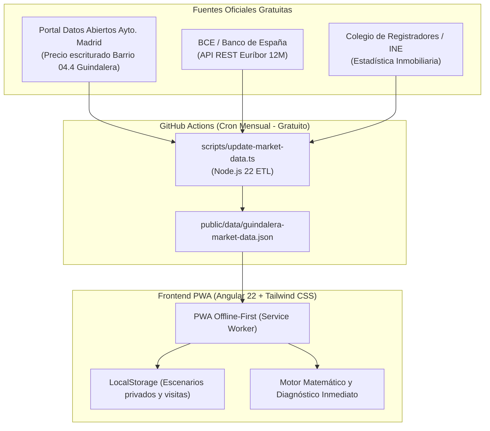

# Plataforma de Decisión Inmobiliaria, Hipoteca y Reforma (PWA)
### Especialización: La Guindalera (Distrito de Salamanca, Madrid)

Una Progressive Web App (PWA) profesional, moderna, responsive y 100% offline-first desarrollada con **Angular 22** (Standalone Components, Angular Signals y Reactive Forms) y **Tailwind CSS**. 

Diseñada específicamente para tomar **decisiones inmobiliarias basadas en datos reales** en la compra de pisos para reformar en España (con foco en **La Guindalera, Madrid**): monitorización de precios reales declarados ante notario vs. ofertas de portales, motor paramétrico de reforma integral, comparativa de modalidades de financiación (hipoteca estándar vs. hipoteca compra + reforma), radar de tipos y Euríbor, y fichas de inspección técnica in-situ.

Desplegable de forma directa y automatizada en **GitHub Pages** con **coste 0 €/mes** y sin dependencias de servidores de pago.

---

## 🚀 Módulos y Capacidades Principales

### 1. 📊 Simulador Financiero e Hipotecario Integral
* **Financiación Bancaria**: Precio de compraventa pactado, porcentaje de financiación (LTV), plazo de amortización en años y Tipo de Interés Nominal (TIN anual).
* **Fórmula de Amortización Francesa**:
  $$M = \frac{P \cdot r \cdot (1+r)^n}{(1+r)^n - 1}$$
  donde $P$ es el capital financiado total (inmueble + reforma financiada), $r = \frac{\text{TIN}}{12 \cdot 100}$ y $n = \text{plazo en meses}$.
* **Fiscalidad y Gastos de Transmisión (Comunidad de Madrid)**:
  * ITP (Impuesto sobre Transmisiones Patrimoniales) al tipo general del **6%** o reducido del **4%** (familias numerosas o jóvenes).
  * Aranceles notariales, inscripción en el Registro de la Propiedad, honorarios de gestoría administrativa y tasación oficial homologada (normativa ECO).
* **Capacidad Familiar y Diagnósticos de Riesgo**:
  * Ratio de endeudamiento neto mensual frente al umbral prudencial del Banco de España (**35%**).
  * Margen familiar neto remanente tras pagar la cuota.
  * Diagnóstico de liquidez: balance de fondos suficientes (con colchón remanente) o déficit de fondos propios requeridos.

---

### 2. 🔨 Motor Paramétrico de Reforma y Proyección de Equity (Plusvalía)
* **Superficie 100% Flexible**: Diseñado para evaluar viviendas de **120 m²** (caso típico de reforma integral familiar en La Guindalera) o cualquier otra superficie entre 30 y 300+ m².
* **Calidades y Precios Unitarios de Mercado (Madrid)**:
  * *Básica / Funcional*: ~850 €/m² (suelo laminado AC5, ventanas PVC estándar, cocina y baños funcionales).
  * *Media / Confort (Recomendada)*: ~1.100 €/m² (suelo porcelánico/tarima, ventanas Climalit Guardian Sun, cocina porcelánica, 2 baños y aerotermia/conductos).
  * *Alta / Diseño*: ~1.350 €/m² (suelo radiante/refrescante, tabiquería a medida, domótica y carpintería artesanal).
  * *Personalizada*: Ajuste libre del coste unitario por metro cuadrado.
* **Desglose Fiscal de la Obra en Madrid**:
  * **IVA reducido (10%)** aplicable a reformas de vivienda habitual (Ley 37/1992).
  * **Impuesto municipal ICIO (4%)** del Ayuntamiento de Madrid sobre el presupuesto de ejecución material.
* **Estimación por Partidas de Obra**: Demoliciones y residuos (8%), albañilería (15%), fontanería (8%), electricidad REBT (10%), climatización/aerotermia (14%), ventanas Climalit (12%), cocina (13%), baños (9%), suelos (6%) y pintura lisa (5%).
* **Financiación Dual de Reforma**:
  * *Aportación 100% fondos propios*: La obra se cubre íntegramente con tus ahorros en efectivo.
  * *Hipoteca Compra + Reforma*: El banco financia hasta el 80% de la obra liberando fondos mediante certificaciones técnicas de avance.
* **Proyección de Equity y Margen de Seguridad**:
  * Compara el **Coste Total Invertido** (Compraventa + Gastos e ITP + Reforma con impuestos) con el **Valor de Mercado Terminado** de la vivienda (€/m² en La Guindalera).
  * Calcula la **Plusvalía Neta Latente** generada en patrimonio neto (€ y % sobre inversión) desde el día de finalización de las obras.

---

### 3. 📈 Observatorio de Mercado Inmobiliario: La Guindalera
* **Precios Reales Escriturados vs. Precios de Oferta**:
  * Serie histórica trimestral oficial que contrasta el **precio real declarado ante notario** (Fuente: Ayuntamiento de Madrid y Colegio de Registradores) con el **precio ofertado en portales** (Idealista/Fotocasa).
* **Termómetro del Ciclo Inmobiliario**:
  * Detección de fases de mercado (Alza, Estancamiento/Meseta, Corrección) analizando la evolución trimestral de precios, el volumen de transacciones y los días medios de venta en el barrio (actualmente ~72 días).
* **Calculador de Contraoferta Inteligente**:
  * Introduce el precio que pide la inmobiliaria en el anuncio y calcula automáticamente la **contraoferta óptima recomendada** basada en el margen histórico de regateo del barrio (~8,6%).
  * Calcula el ahorro neto en precio y el ahorro adicional en el ITP (6% de Madrid), permitiendo volcar la oferta directamente al simulador hipotecario con un solo clic.
* **Gráfico SVG Interactivo**:
  * Visualización de la evolución temporal con sombreado dinámico de la brecha de negociación.

---

### 4. ⚡ Radar de Euríbor y Test de Estrés Financiero
* **Monitorización Oficial**: Último dato oficial del Euríbor a 12 meses publicado por el Banco de España en el BOE y su media móvil de los últimos 12 meses.
* **Simulador de Sensibilidad de Cuota**:
  * *Escenario Optimista (1,75%)*: Bajada de tipos de interés del Banco Central Europeo.
  * *Escenario Base / Consenso (2,20%)*: Tipos de interés neutrales a medio plazo.
  * *Escenario Pesimista / Inflación (3,65%)*: Tipos elevados sostenidos o repunte inflacionario.
  * Muestra la cuota resultante y la diferencia mensual (€/mes) respecto al escenario actual.

---

### 5. 📋 Fichas de Inspección y Scouting Técnico (In-Situ)
Diseñado para llevar en el móvil durante las visitas a pisos en La Guindalera:
* **Checklist Técnico Crítico**:
  * ¿Finca con ascensor o hueco viable en ojo de escalera? (Instalar ascensor en fincas de Guindalera suele suponer derramas de 8.000 € - 15.000 € por vecino).
  * ¿ITE favorable o con deficiencias? ¿Derramas extraordinarias aprobadas?
  * Estructura: **Pilares de hormigón** (permite tirar tabiques para hacer concepto abierto de 120 m²) vs. **Muros de carga** vs. **Mixta**.
  * Instalaciones: Calefacción central vs. individual de gas, altura libre de techos (m), cuota de comunidad e IBI.
* **Capacidad Máxima de Compra**:
  * Calcula el precio máximo que puedes ofertar para no agotar tu colchón de emergencia (20.000 € de reserva tras pagar entrada, gastos y reforma).
* **Exportación al Simulador**:
  * Botón para transferir un piso visitado directamente a un escenario del simulador hipotecario.

---

### 6. ⚖️ Comparador Multiescenario y Respaldo
* Gestión, clonado y comparación lado a lado de múltiples alternativas (ej: *Piso Cartagena 120m² a 540k* vs. *Piso Martínez Izquierdo 95m² a 460k*).
* Almacenamiento 100% local en **LocalStorage** sin enviar tus datos financieros a ningún servidor externo.
* Exportación e importación en formato JSON para copias de seguridad.

---

## 🏗️ Arquitectura Técnica y Coste Cero



* **Frontend**: Angular 22, Standalone Components, Angular Signals, Tailwind CSS v4.
* **Testing**: Vitest con 19 pruebas unitarias automatizadas.
* **Despliegue**: GitHub Pages (CDN global, HTTPS automático, 0 €/mes).
* **ETL Programado**: GitHub Actions (`.github/workflows/update-market-data.yml`), ejecutado automáticamente el día 2 de cada mes a las 06:00 UTC.

---

## 🛠️ Comandos de Desarrollo

```bash
# Instalar dependencias
pnpm install

# Iniciar servidor de desarrollo local
pnpm start
# o: pnpm exec ng serve (accesible en http://localhost:4200/)

# Ejecutar suite de pruebas unitarias (Vitest)
pnpm test

# Sincronizar datos de mercado y Euríbor manualmente
pnpm run update-data

# Compilar para producción
pnpm build

# Compilar para GitHub Pages con base-href
pnpm run build:gh-pages
```

---

## 📚 Guías de Referencia en el Repositorio

* [Guía Práctica de Compra y Reforma en La Guindalera](docs/guia-compra-guindalera.md): Consejos específicos de negociación con agencias, tipos de fincas en el barrio, costes reales de obra y claves para evitar sustos en la tasación o con Hacienda (Valor de Referencia de Catastro).
